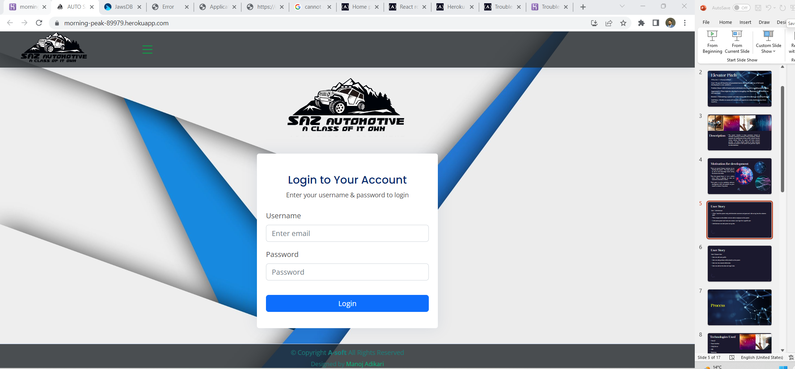
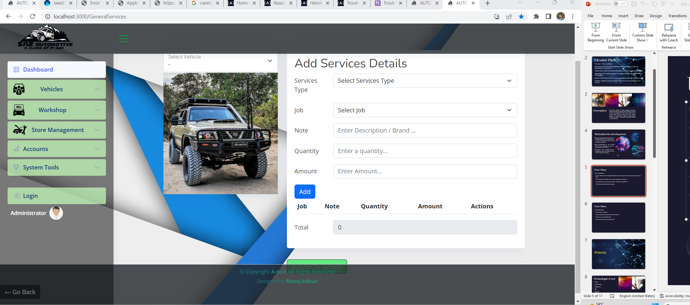
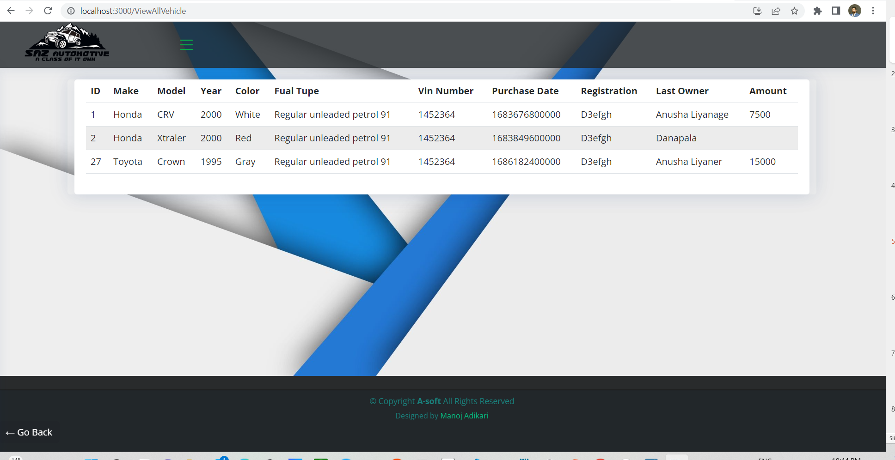

README.md
# SAZ AUTOMOMOTIVE!


```
## Description:
To put all theories and practicals learnt during the journey of full stack developing in a one  platform .60% of automotive individuals time is spent on finding previous data .That might be why they’re struggling with expanding their business to the next level.Maintaining a system can help reduce the time spent on accessing all data.Enable to access all records and reports to make decisions anywhere The system includes 6 major processes related to individual automotive business. Firstly, purchasing vehicles secondly, do modifications thirdly, selling vehicles fourthly, renting vehicles, fifthly, do repairs and finally maintain services.  All these records related to these business functions are stored in this system and generate reports to make decisions.There are several factors motivate me to develop this system.  The major point is to use all the knowledge learnt during the course into action
```

## Table of Contents:<br />

- [Installation](#installation)<br />

- [Usage](#usage)<br />

- [Contributing](#contributing)<br />

- [Testing](#testing)<br />

- [Github](#my_github_profile)<br />

- [Licence](#license)<br />

- [Questions](#questions)<br />

## Installation:
To install the necessary dependancies please run the following command:
```
N/A
```

## Usage:

When I load the system, using administration username and password  able to log into the welcome page.Then navigate to the sidebar and can add an employee to the system.In the same system tool menu can create a user login for a specific user.Administrator can add system set up data
To view this application,the following image shows the landing page of the application, or click on the page link that demonstrates the functionality of this project:\
<https://morning-peak-89979.herokuapp.com/>

APP installation:
  

Web APP interface:


Manifest.json:



IndexedDB:



## Contributing:
```
Clone the project to your own machine useing $ git clone.Pull requests are welcome. For major changes, please open an issue first to discuss what you would like to change.
```
## Testing:

```
open server.js on integrated terminal and use command 'npm start'  to run the program
```


## My GitHub profile:

This is My GitHub profile; manojadikari
[see my GitHub profile ](https://github.com/ManojAdikari)


## License:
```
This project is licensed under; MIT
```

## Questions:
[Please use this this video url for more information about this application ](https://github.com/ManojAdikari/Professional_README_Generator)<br />
[see this project Repositorie ](https://github.com/ManojAdikari/Saz_Automotive.git)<br />
[Clone this project](https://github.com/ManojAdikari/Saz_Automotive.git) <br />
[Clone this project](git@github.com:ManojAdikari/Saz_Automotive.git)<br />
If you have any questions about this project please feel free to reach  via email at [manojpadikari@gmail.com](mailto:manojpadikari@gmail.com).